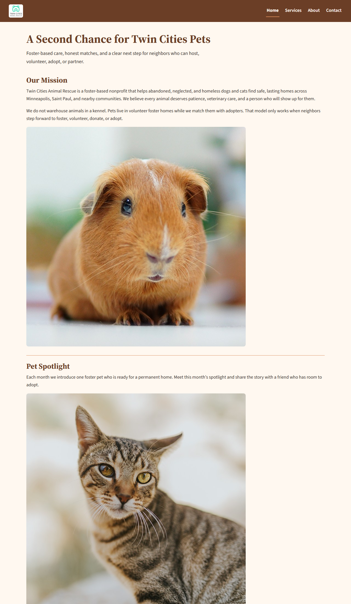

# Touchstone 3: Visual Design and Responsive Layout

**STUDENT EXEMPLAR**

**Name:** Kyla Barton  
**Course:** Introduction to Web Development  
**Date:** September 21, 2026  
**Selected Client:** Twin Cities Animal Rescue

## Section 1: GitHub Link

Paste your public GitHub repository URL here:https://github.com/bartonkyla/glowing-meme

## Section 2: Design Explanation

Respond to each prompt in 3–5 sentences. Use specific examples from your website.

### Client Alignment

Twin Cities Animal Rescue is a foster-based nonprofit, so the site has to feel hopeful and trustworthy while still pointing visitors toward a concrete next step: foster, volunteer, adopt, or partner. I kept the four-page structure from Touchstone Task 2 and used one external stylesheet so Home, Services, About, and Contact look like the same organization. The brown header and footer repeat the rescue name and the same Home / Services / About / Contact list on every page, which makes the path to the interest form obvious and easy to navigate. I used cream page backgrounds and charcoal body text keep the mission, impact numbers, and program details easy to read instead of looking like a tech product or an online store. Peach is used only as an accent—on the current-page underline, card borders, and focus outlines, making them stand out.

### Color Palette

I used four main colors in `css/style.css`: cream `#FFF8F0`, brown `#6B3E26`, peach `#D88C5A`, and charcoal `#2F2A26`. Cream is the page and card background, it feels warm and homey, which matches a foster-based rescue better than, for example, a cold white or blue canvas. Charcoal is the body text color, so paragraphs on cream stay high contrast and readable on a phone or a desktop. Brown is used for the header, footer, headings, links, and the “Send interest form” button, with cream type on those brown surfaces so navigation and the call to action remain clear. Peach marks emphasis as it is located on the left border on "How You Can Help" and impact cards, the underline under the current nav link, and the focus outline on form fields.

### Typography

I used two Google Fonts families, with system fallbacks if the files do not load: Source Serif 4 for the site name, h1, h2, h3, and form legends, and Source Sans 3 for body copy, navigation, lists, fields, and the button. The serif headings feel editorial and familiar, which fits a community nonprofit. The sans-serif body stays clear at a small size and keeps the site to two font families. Hierarchy comes from size and weight, not extra fonts.The Home h1 “A Second Chance for Twin Cities Pets” is the largest brown serif line, h2 titles such as “How You Can Help” and “Interest Form” are smaller, About values use h3 titles inside each card, and body text sits at about 1.05rem with 1.65 line-height so visitors can skim sections without reading every word.

### Responsive Design

The CSS is mobile-first and uses Flexbox for the header, navigation, help cards, values, program sections, form, and footer. On a narrow screen those pieces stack in one column so a visitor can scroll from the rescue name to the Contact link without sideways overflow. Images and the welcome video use `max-width: 100%`, and the Home `picture` element still loads the smaller feature photo below 700px. One media query at `min-width: 48rem` (768px) changes the layout for larger screens. Concrete example: the four How You Can Help items (Foster, Volunteer, Adopt, Partner) are full-width stacked cards on a phone; at 768px and wider the same list becomes a two-by-two Flexbox row, the header switches from a stacked column to a horizontal bar, and the two Contact fieldsets sit side by side.

### Design Challenge

The hardest part was styling the Contact interest form without breaking the required Task 2 HTML. The form already had a label for every control, two fieldsets with legends, required fields, and the 000-000-0000 telephone pattern, so I could not replace it with a custom unlabeled layout. I kept that structure and styled the existing elements: labels sit above their fields in a Flexbox column, legends stay visible in Source Serif 4, and fieldsets use a peach border so “Your contact information” and “How you want to help” still read as groups. On wider screens the fieldsets sit in a row, but the submit button stays on its own full-width row so it is not tucked beside the notes box. No JavaScript was added, so the browser’s built-in validation still works.

## Section 3: Submission Checklist

Check each item when complete.

- [x] I continued the same Twin Cities Animal Rescue site from Touchstone Task 2.
- [x] I submitted updated website files including HTML and CSS.
- [x] All four pages link to one external stylesheet (`css/style.css`).
- [x] I used 2 to 4 main colors (cream, brown, peach, charcoal).
- [x] I used no more than 2 font families (Source Serif 4 and Source Sans 3).
- [x] Navigation, headings, sections, footer, form, buttons, and media are styled consistently.
- [x] Text is readable against background colors (charcoal on cream; cream on brown).
- [x] I used Flexbox for layout and at least one media query for larger screens.
- [x] The form still includes labels, fieldset, and legend.
- [x] The video element still includes fallback text.
- [x] Navigation uses relative paths (index.html, services.html, about.html, contact.html).
- [x] I included a public GitHub repository link.

## Section 4: Screenshot of the site demonstrating a described design decision

Insert a screenshot of your website that demonstrates one design decision described above.

**Caption:** Home page at a desktop-like width. The brown header keeps cream navigation in one row, peach underlines the current Home link, and the How You Can Help items sit as side-by-side Flexbox cards. This screenshot supports the Color Palette and Responsive Design explanations: cream/brown/peach contrast plus the 768px layout change from stacked cards to a multi-column row.

## Section 5: Final Review

Review your work before you submit.

- [x] I previewed the site on a small screen and a large screen.
- [x] Navigation links use relative paths and move between all four pages.
- [x] Text remains readable against cream and brown backgrounds.
- [x] The interest form still includes labels, fieldset, and legend.
- [x] The welcome video still includes fallback text inside the video element.
- [x] I did not add JavaScript; behavior stays HTML and CSS only.
- [x] I continued the same client and pages from Touchstone Task 2.
- [x] I explained design decisions with specific examples from the live site.
- [x] I opened the GitHub link in a private or incognito window to confirm it is public.
